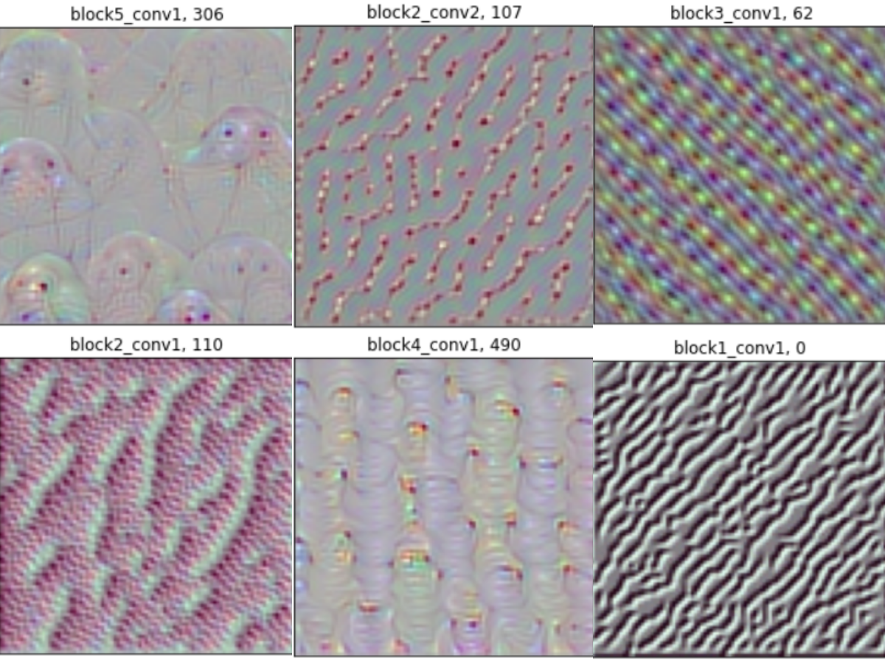
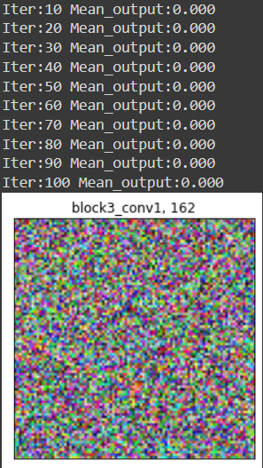

# UnderstandingFiltersofCNN
We use polpular CNN Architecture VGG-16 provided by keras pretained on the imagenet data.
We need to use pretained model cause only in a trained model filters have learned to get activated for specific input features.
In this project we visualize those inputs.  

The complexities of those images increase for the filters deeper into the nework.
Following are set of images which depicts that:  

  

While some filters may be doing no role even in the trained model.For example,  

